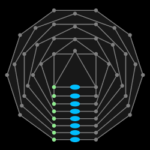

# PD

PD (PIL draw) is a Python drawing library. (Uses aggdraw on PIL Image surface) You can check out the [wiki page](https://github.com/setanarut/pd/wiki/Quick-Start#a-simple-ellipse-drawing) for a quick start.

## Installation

```shell
pip install git+https://github.com/setanarut/pd
```

## Example animation

```python
from pd import *

canvas(250, 250)
turns = [*range(2, 10)]
polys = [regular_polygon((125, 125), n, 70, True)
         for n in range(10, 2, -1)]
motion_paths = []
mover = ellipse((0, 0), 8, 4)
for i, poly in enumerate(polys):
    poly.add_point((1 / poly.segs) / 2)
    poly.set_start(1)
    motion_paths.append(poly.repeated(turns[i]))
for t in linspace(0, 1, 400):
    clear()
    for i, poly in enumerate(polys):
        point, angle = motion_paths[i].point_and_angle(t)
        poly.draw_debug()
        mover.set_pos(point).rotated(angle).draw("deepskyblue", None)
    append_frame()
save_gif("polys.gif", 33.33333)
```


